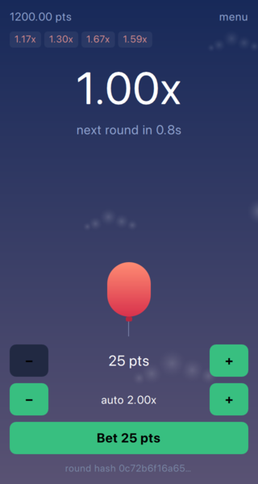
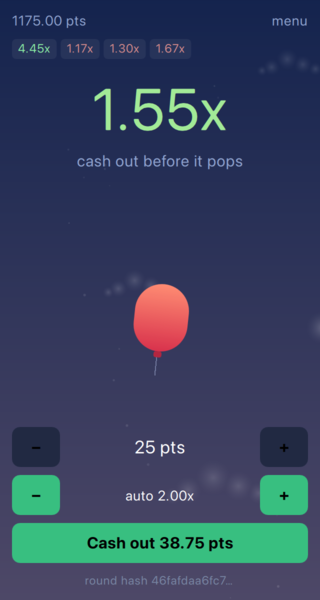
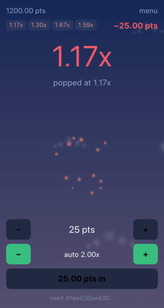
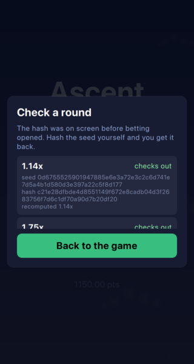

# Ascent

A points-based "crash" game built with [Felgo](https://felgo.com) and Qt 6.

A balloon rises and a multiplier climbs from 1.00x. It pops at a random — but
pre-committed — point. Cash out before it pops and your stake is multiplied.
Wait too long and you lose it.

No real money. Points only.

<p align="center">
  
  
  
  
</p>

## Features

- Continuous rounds with a betting window, so you can watch the ones you sit out
- Provably fair crash points: the seed hash is shown before the round and
  revealed after, so any round can be verified
- Auto cash out at a target multiplier
- Persistent balance, round history and statistics

## Provably fair

Before a round starts the game commits to its crash point by showing a hash.
After the round it reveals the seed behind that hash. Anyone can rehash the
seed to confirm it is the one that was committed to, and rerun the game's own
arithmetic to confirm the crash point followed from it.

The verification screen does exactly that, on every past round in the strip,
and it recomputes rather than reads back a stored verdict — a verdict stored
next to the data it is meant to be checking proves nothing.

## Requirements

- Felgo SDK 4.3.1, which bundles Qt 6.8.3
- CMake 3.16 or newer
- Xcode, for the macOS and iOS toolchains

The paths below are the default macOS install locations. `CMAKE_PREFIX_PATH`
is what points CMake at the Felgo kit; without it `find_package(Felgo)` fails.

## Building for macOS

```sh
cmake -S . -B build \
  -DCMAKE_BUILD_TYPE=Release \
  -DCMAKE_PREFIX_PATH=$HOME/Felgo/Felgo/macos
cmake --build build
open build/Ascent.app
```

Use `-DCMAKE_BUILD_TYPE=Debug` while working on the game. That build copies the
QML and the assets next to the binary instead of compiling them in, so a QML
edit is picked up by restarting the app rather than by rebuilding it. Any other
build type ships them inside the binary. The reasoning is in the
[last tutorial chapter](doc/ascent-shipping.qdoc).

The app shows Felgo's splash screen on startup. That is what an empty
`PRODUCT_LICENSE_KEY` in `CMakeLists.txt` buys; a key removes it.

## Building for iOS

The device build needs a signing team. It is passed on the command line rather
than written into `CMakeLists.txt`, because it belongs to whoever is building
and not to the project. A free Apple ID gives you a Personal Team, which signs
apps that run for seven days.

```sh
~/Felgo/Felgo/macos/bin/qt-cmake -GXcode -S . -B build/ios \
  -DCMAKE_XCODE_ATTRIBUTE_DEVELOPMENT_TEAM=<YOUR_TEAM_ID> \
  -DCMAKE_XCODE_ATTRIBUTE_CODE_SIGN_STYLE=Automatic
cmake --build build/ios --config Debug -- -sdk iphoneos -allowProvisioningUpdates
xcrun devicectl device install app --device <UDID> build/ios/Debug-iphoneos/Ascent.app
xcrun devicectl device process launch --device <UDID> com.merdak.ascent
```

Two of the steps happen on the phone, once: enable Developer Mode under
Settings → Privacy & Security, which reboots it, and trust the certificate
under Settings → General → VPN & Device Management, without which the app
installs and then refuses to launch.

The Simulator is not supported on Apple silicon, and that is the SDK's shape
rather than a misconfiguration: an iOS binary targets an architecture *and* a
platform, and the Felgo kit ships `arm64 + iOS` and `x86_64 + iOS-simulator`.
The modern Simulator runtime accepts arm64 only, so neither slice fits it. The
phone is unaffected — the pair it wants is the pair the SDK has.

## Tests

The game logic is plain QtCore and is tested without a window, a clock or a
running app.

```sh
ctest --test-dir build
```

Eight suites, one executable each, so a failure names the file it lives in.

## The tutorial

A step-by-step tutorial explaining how this game was built is written alongside
the code, in QDoc. The prose is in [`doc/`](doc/) as `.qdoc` sources; no code
is pasted into it, every listing is pulled out of the real files with
`\snippet`, so a sample in the tutorial is a sample that compiles.

The generated HTML is committed. Open `doc/html/index.html` in a browser to
read it. To regenerate it after changing either the prose or the code it quotes:

```sh
cmake --build build --target docs
```

That target is not part of the default build, so a documentation warning cannot
break a code build. It writes into `doc/html`, clearing the previous run first.
A broken link or an unresolved snippet fails the run rather than scrolling past.

## Layout

| | |
|---|---|
| `src/` | The game logic in C++: the curve, the round engine, fairness, the wallet, stats, history |
| `qml/` | The interface, and everything that moves |
| `assets/` | Sounds and images |
| `tests/` | One Qt Test suite per class in `src/` |
| `doc/` | The tutorial: `.qdoc` sources, images, and the generated `html/` |
| `ios/`, `macx/` | Per-platform bundle files: plists, launch screen, icons |
